# Setting up
1. Go to [Discord's Developer Portal](https://discord.com/developers/applications)

How it should look like (Without the bots if you don't have any already)
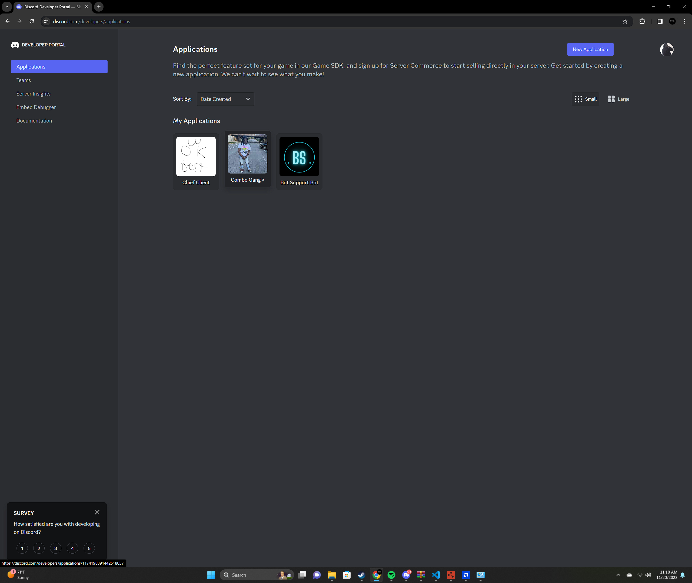

2. Click the blue box in the top right labeled "New Application" and fill out the fields it asks you
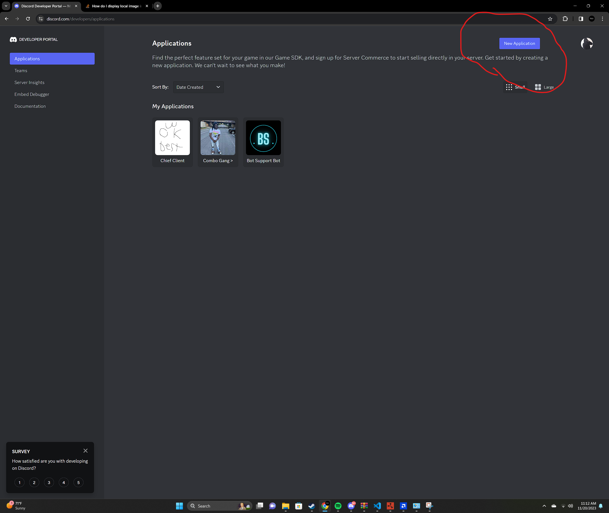
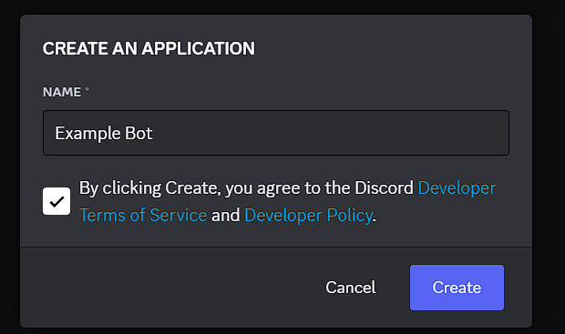

There you go! You have a bot, you can go through and Customize if you want, but if you want to actually start the bot, lets continue

# Setting up the bot & Running it 
1. Drag the "bot.env" file into the ./bot folder, and delete the "bot" part of it. Then fill in the values (If you don't know how to get those values, keep following this tutorial)
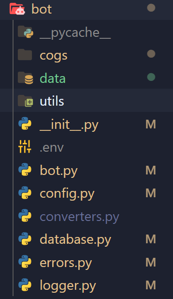

2. Click the "Bot" tab on the left side of your created application
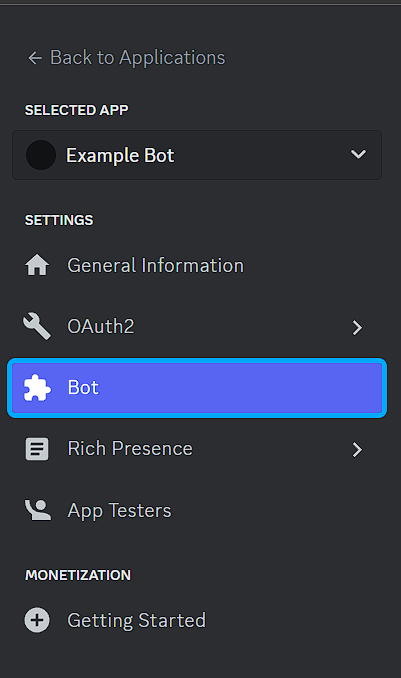

3. Click the blue button with the label "Reset Token" button, and copy that value into the .env file in your ./bot folder under the "BOT_TOKEN" value into the two quotes
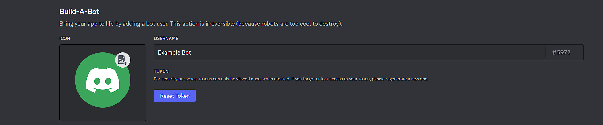

4. Enable developer mode on your discord app Follow this [Tutorial](https://www.howtogeek.com/714348/how-to-enable-or-disable-developer-mode-on-discord/) if you don't know how too

5. Copy your own user id by clicking on your own profile picture, and click "Copy User ID" on the bottom of it, and then copy that value into the "OWNER_ID" field in the .env
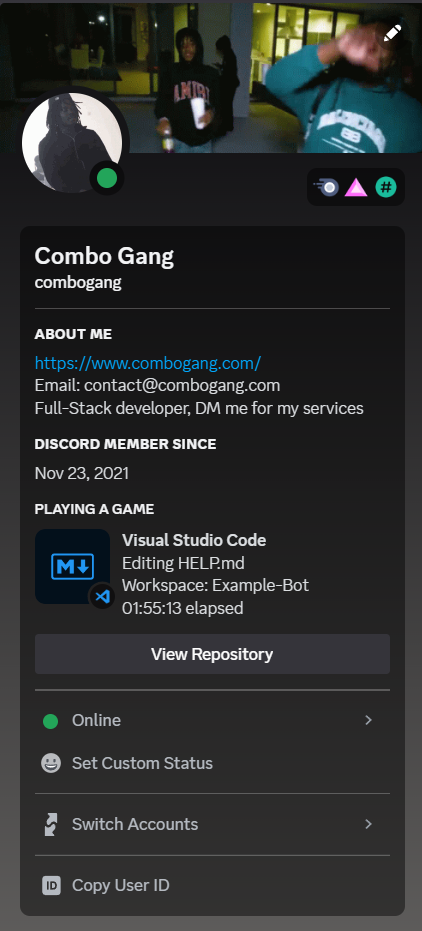

6. Copy your support / testing server id by right clicking your preferred server, and clicking the "Copy Server ID" button at the bottom, and then copy that value into the "SUPPORT_ID" field in the .env
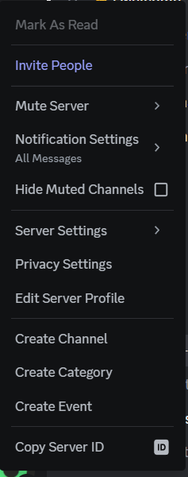

7. Run ```pip install -r requirements.txt``` or ```python -m pip install -r requirements.txt```

8. To start the bot run ```python launcher.py bot``` or ```python3 launcher.py bot```

# Setting up & Running the Dashboard
1. Drag the dashboard.env into your ./dashboard and delete the dashboard prefix (it should just be named .env)
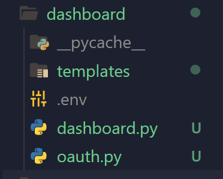

2. Go back to your application on the [Discord Developer Portal](https://discord.com/developers/applications), and click on the "OAuth2" tab and in the "General" section.
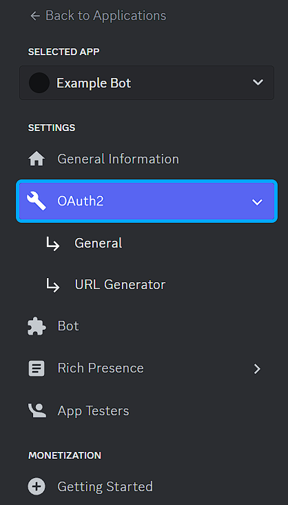

3. Click the blue button labeled "Add Redirect" And enter "http://127.0.0.1:8080/login"
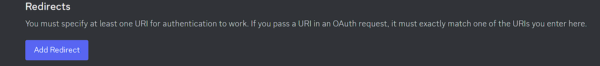
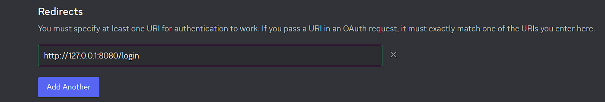

4. Create a oauth2 url by going under the "URL Generator" section of the "OAuth2" tab and select the shown scopes & select the redirect url we created before, and it should generate a link. Copy that into your .env in your ./dashboard under the "OAUTH_URL" Value
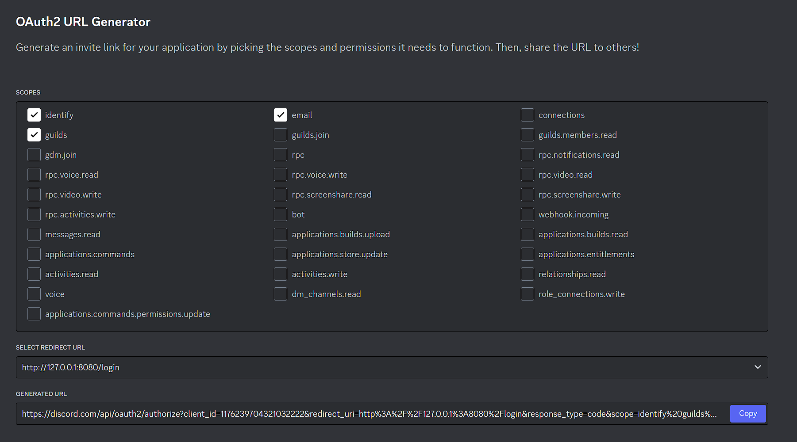

5. Go back to "General" Tab of the "OAuth2" Tab, and at the top where it says "Client ID" and "Client Secret", Copy the "Client ID" into the .env under the "CLIENT_ID" Value, and click "Reset Secret" and copy that under the "CLIENT_SECRET" in the .env file

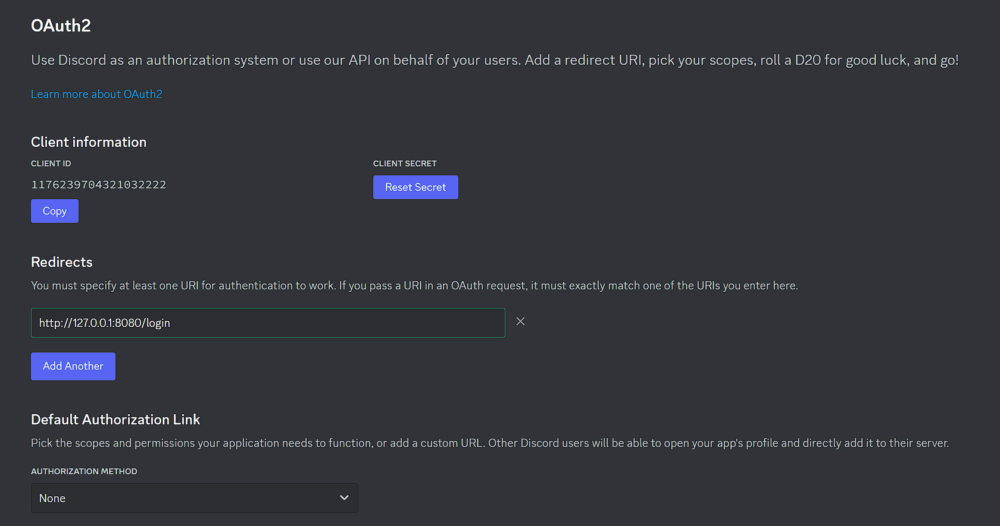

6. Run ```pip install -r requirements.txt``` or ```python -m pip install -r requirements.txt```

7. To start the bot run ```python launcher.py dashboard``` or ```python3 launcher.py dashboard```

8. Visit [Your Website](http://127.0.0.1:8080)

# Api
1. This ones a bit more striaght foward, all you gotta do is ```pip install -r requirements.txt``` or ```python -m pip install -r requirements.txt```

2. Then run ```python launcher.py bot api``` or ```python3 launcher.py api```

# Note
Check out my [website](combogang.com)

Check out this discord [server](https://discord.gg/VydyERgcxR)

Check out my [Instagram](https://www.instagram.com/combogangdev/)

Check out my [Twitter](https://twitter.com/ComboGangDev)